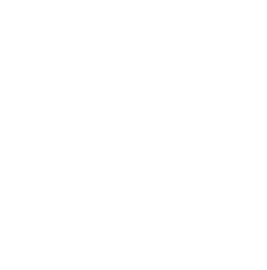
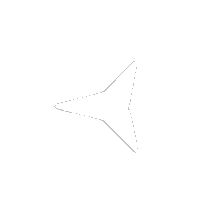
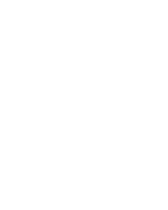
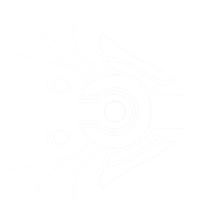
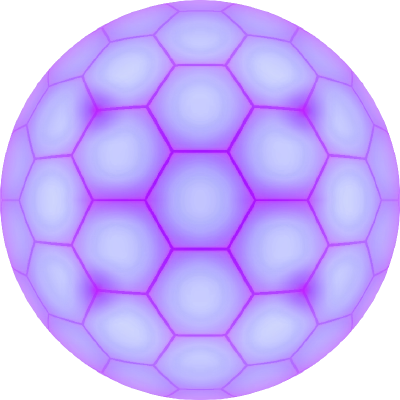

# # Page 6[Page_5](./Page_5.md)[Page_6](./Page_6.md)[Page_7](./Page_7.md)
## **avtraxi.png**: 
 |  |  |
 | --- | --- |
 | Body: | avtraxi_force.png |
 | Fource Armour: | avtraxi_drone.png |
 | Drone: |  |
 | Angle: | 90 |
 | Distance: | 30 |

Copy this: `avtraxi.png,avtraxi_force.png,avtraxi_drone.png,,90,30`

[Download Me](../assets/zips/avtraxi.png.zip)

## **Jormungandr**: 
 |  |  |
 | --- | --- |
 | Body: | jormungandr_body.png |
 | Fource Armour: | jormungandr_force.png |
 | Drone: |  |
 | Angle: | 130 |
 | Distance: | 55 |

Copy this: `Jormungandr,jormungandr_body.png,jormungandr_force.png,,130,55`

[Download Me](../assets/zips/Jormungandr.zip)

## **GWclaw**: 
 |  |  |
 | --- | --- |
 | Body: | GWclaw.png |
 | Fource Armour: | GWclaw_force.png |
 | Drone: | GWattack_drone.png |
 | Angle: | 87 |
 | Distance: | 20 |

Copy this: `GWclaw,GWclaw.png,GWclaw_force.png,GWattack_drone.png,87,20`

[Download Me](../assets/zips/GWclaw.zip)

## **Thresher**: 
 |  |  |
 | --- | --- |
 | Body: | thresher.png |
 | Fource Armour: | thresher_force.png |
 | Drone: |  |
 | Angle: | 126 |
 | Distance: | 48 |

Copy this: `Thresher,thresher.png,thresher_force.png,,126,48`

[Download Me](../assets/zips/Thresher.zip)

## **The Pentagon**: 
 |  |  |
 | --- | --- |
 | Body: | pentagon.png |
 | Fource Armour: | pentagonforce.png |
 | Drone: | pentagondrone.png |
 | Angle: | 103 |
 | Distance: | 55 |

Copy this: `The Pentagon,pentagon.png,pentagonforce.png,pentagondrone.png,103,55`

[Download Me](../assets/zips/The Pentagon.zip)

## **Ophanim**: 
 |  |  |
 | --- | --- |
 | Body: | ophanim.png |
 | Fource Armour: | ophanim_force.png |
 | Drone: | ophanim_drone.png |
 | Angle: | 155 |
 | Distance: | 33 |

Copy this: `Ophanim,ophanim.png,ophanim_force.png,ophanim_drone.png,155,33`

[Download Me](../assets/zips/Ophanim.zip)

## **Inferno**: 
 |  |  |
 | --- | --- |
 | Body: | inferno.png |
 | Fource Armour: | inferno_force.png |
 | Drone: | inferno_drone.png |
 | Angle: | 0 |
 | Distance: | 0 |

Copy this: `Inferno,inferno.png,inferno_force.png,inferno_drone.png,0,0`

[Download Me](../assets/zips/Inferno.zip)

## **Cherub**: 
 |  |  |
 | --- | --- |
 | Body: | cherub.png |
 | Fource Armour: | cherub_force.png |
 | Drone: | cherub_drone.png |
 | Angle: | 0 |
 | Distance: | 0 |

Copy this: `Cherub,cherub.png,cherub_force.png,cherub_drone.png,0,0`

[Download Me](../assets/zips/Cherub.zip)

## **XS-01 Artemis**: 
 |  |  |
 | --- | --- |
 | Body: | XS_01_Artemis_Body.png |
 | Fource Armour: | XS_01_Artemis_Shield.png |
 | Drone: |  |
 | Angle: | 120 |
 | Distance: | 0 |

Copy this: `XS-01 Artemis,XS_01_Artemis_Body.png,XS_01_Artemis_Shield.png,,120,0`

[Download Me](../assets/zips/XS-01 Artemis.zip)

## **Warforge**: 
 |  |  |
 | --- | --- |
 | Body: | warforge.png |
 | Fource Armour: | warforge_force.png |
 | Drone: | warforge_drone.png |
 | Angle: |  |
 | Distance: |  |

Copy this: `Warforge,warforge.png,warforge_force.png,warforge_drone.png,,`

[Download Me](../assets/zips/Warforge.zip)

[Page_5](./Page_5.md)[Page_6](./Page_6.md)[Page_7](./Page_7.md)